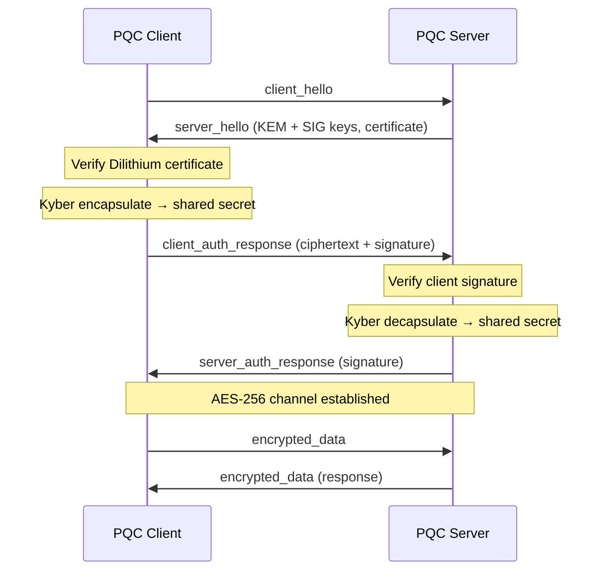

<div align="center">

# ◈ NOMAD CYBER ALGORITHM

### Post-Quantum Microservice Communication Layer

[](https://www.typescriptlang.org/)
[](https://nodejs.org/)
[](https://openquantumsafe.org/)
[](LICENSE)

**Quantum-resistant TCP microservice handshake · Mutual authentication · Encrypted payload channel**

<br/>

```
╔══════════════════════════════════════════════════════════════════╗
║  KYBER768 KEM  ──►  Shared Secret  ──►  AES-256-CBC Channel     ║
║  DILITHIUM3 SIG ──►  Mutual Auth   ──►  Certificate Validation  ║
╚══════════════════════════════════════════════════════════════════╝
```

<br/>

[Overview](#-overview) ·
[Architecture](#-architecture) ·
[Quick Start](#-quick-start) ·
[Protocol](#-protocol-flow) ·
[Stack](#-crypto-stack) ·
[Credits](#-built-by)

</div>

---

## ◇ Overview

**Nomad Cyber Algorithm** is a TypeScript reference implementation for **post-quantum cryptography (PQC)** in microservice-to-microservice communication. It demonstrates how two services can establish a quantum-resistant secure channel over raw TCP — without relying on classical TLS alone.

Designed for high-assurance environments: air-gapped networks, SCI/TS workloads, and forward-looking security architectures that must survive the post-quantum threat model.

| Capability | Implementation |
|:---|:---|
| **Key Exchange** | Kyber768 (ML-KEM) via OQS |
| **Authentication** | Dilithium3 (ML-DSA) signatures |
| **Data Channel** | AES-256-CBC + scrypt key derivation |
| **Transport** | Length-prefixed TCP framing |
| **Runtime** | Node.js · TypeScript · Strict mode |

---

## ◇ Architecture



```
┌─────────────────┐         TCP :8443          ┌─────────────────┐
│  PQCClientService│ ◄────────────────────────► │ PQCServerService │
│                 │                            │                 │
│  Kyber768 (ephemeral)                        │  Kyber768       │
│  Dilithium3 (identity)                       │  Dilithium3     │
│  AES-256-CBC                                 │  AES-256-CBC    │
└─────────────────┘                            └─────────────────┘
```

---

## ◇ Quick Start

### Prerequisites

- **Node.js** 20+
- **npm** 10+
- Native build toolchain (required by `@open-quantum-safe/oqs-javascript`)

### Install & Run

```bash
git clone https://github.com/ZorakCorp/nomad_cyber_algorithm.git
cd nomad_cyber_algorithm
npm install
npm run build
npm start
```

### Expected Output

```
--- PQC-Secured Microservice Communication Demo (TypeScript) ---
[SERVER] Listening on port 8443
[CLIENT] Connected to server at localhost:8443
[CLIENT] Server certificate verified (Dilithium3). Authenticated server.
[CLIENT] Shared secret encapsulated. AES key derived: ...
[SERVER] Client signature verified (Dilithium3). Client authenticated.
[DEMO] PQC Handshake successful. Secure channel is ready for application data.
```

---

## ◇ Protocol Flow

| Step | Actor | Message | Action |
|:---:|:---|:---|:---|
| 1 | Client | `client_hello` | Initiate handshake |
| 2 | Server | `server_hello` | Send KEM/SIG keys + PQC certificate |
| 3 | Client | — | Verify server cert (Dilithium3) |
| 4 | Client | — | Kyber encapsulate shared secret |
| 5 | Client | `client_auth_response` | Send ciphertext + signed identity |
| 6 | Server | — | Verify client signature + decapsulate |
| 7 | Server | `server_auth_response` | Confirm handshake with signature |
| 8 | Both | `encrypted_data` | AES-256-CBC application payloads |

---

## ◇ Crypto Stack

```
┌──────────────────────────────────────────────────────────────┐
│  APPLICATION LAYER     JSON messages · hex-encoded cipher  │
├──────────────────────────────────────────────────────────────┤
│  SYMMETRIC LAYER       AES-256-CBC · scrypt KDF · random IV │
├──────────────────────────────────────────────────────────────┤
│  PQC LAYER             Kyber768 (KEM) · Dilithium3 (SIG)   │
├──────────────────────────────────────────────────────────────┤
│  TRANSPORT LAYER       TCP · 4-byte length-prefixed frames │
└──────────────────────────────────────────────────────────────┘
```

> **Note:** This is a **research demonstration**. Production deployments should use a Quantum-Safe CA, formal key management, authenticated encryption (e.g. AES-GCM), and hardened operational controls.

---

## ◇ Project Structure

```
nomad_cyber_algorithm/
├── src/
│   ├── main.ts                 # Demo entry point
│   ├── pqc_client_service.ts   # Client handshake + encryption
│   ├── pqc_server_service.ts   # Server handshake + decryption
│   └── utils.ts                # TCP message framing
├── package.json
├── tsconfig.json
└── README.md
```

---

## ◇ Built By

<div align="center">

<br/>

### **#HouseOfAsher** Research & Developers

### **Aureon Software** · ZANOEM

### **+ Cursor**

<br/>

```
━━━━━━━━━━━━━━━━━━━━━━━━━━━━━━━━━━━━━━━━━━━━━━━━━━━━━━━━━━━━━━
  Research-grade PQC microservice primitives for the post-quantum era
━━━━━━━━━━━━━━━━━━━━━━━━━━━━━━━━━━━━━━━━━━━━━━━━━━━━━━━━━━━━━━
```

<br/>

**ZorakCorp** · [github.com/ZorakCorp/nomad_cyber_algorithm](https://github.com/ZorakCorp/nomad_cyber_algorithm)

</div>

---

<div align="center">

<sub>MIT License · Nomad Cyber Algorithm v1.0.0 · 2027</sub>

</div>
